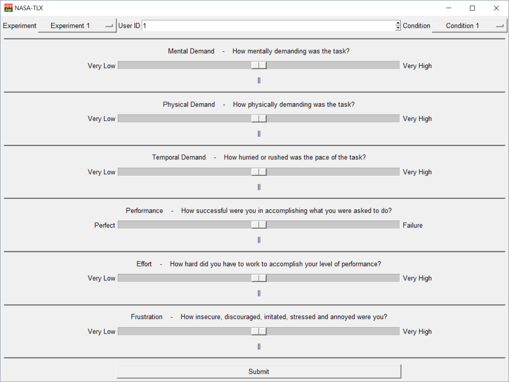

# NASA-TLX
Simplistic electronic version of the "NASA Task Load Index" without subscale weighting (often referred to as Raw TLX) by Hart and Staveland. It avoids the need of collecting the participants' responses on a sheet of paper. Related literature:

 * Hart, S. G., & Staveland, L. E. (1988). Development of NASA-TLX (Task Load Index): Results of empirical and theoretical research. In Advances in psychology (Vol. 52, pp. 139-183). North-Holland.
 * Hart, S. G. (2006, October). NASA-task load index (NASA-TLX); 20 years later. In Proceedings of the human factors and ergonomics society annual meeting (Vol. 50, No. 9, pp. 904-908). Sage CA: Los Angeles, CA: Sage Publications.
 
## Dependencies
 * Python3 (`sudo apt-get install python3` on Debian-based systems) - http://www.python.org/
 * AppJar (`sudo pip3 install appJar` on Debian-based systems) - https://github.com/jarvisteach/appJar
 
## Usage Instructions
The test can be run by `python3 nasa-tlx.py`. The experiment and condition labels can be altered at the top of "nasa-tlx.py". Each question is rated on a scale from 0 to 100 in steps of 5, but the numeric values are hidden to the participant. When pressing the submit button, the results will be appended to a file called "nasa-tlx-results.txt". On each line, it shows the experiment label, the user id, the condition label and the responses to questions 1 to 6 in a comma-separated fashion.

## Screenshot

